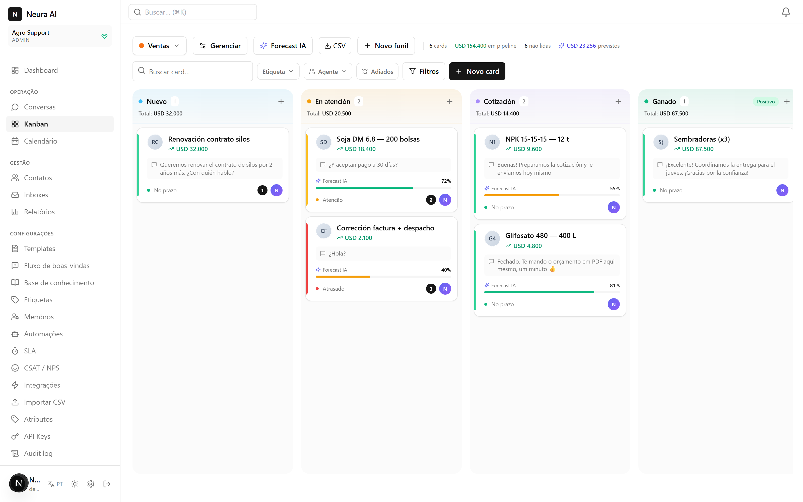
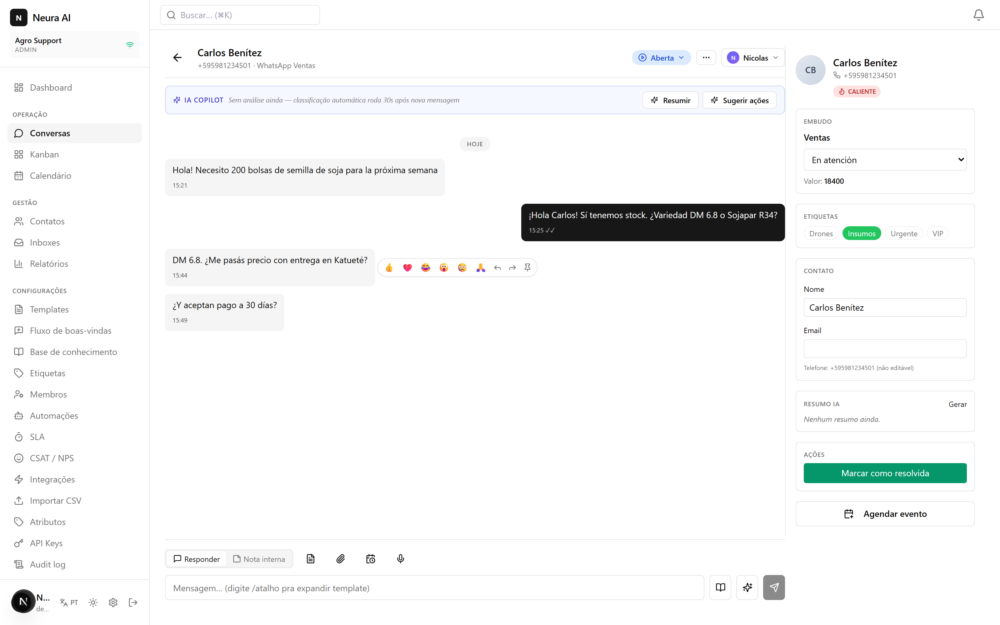
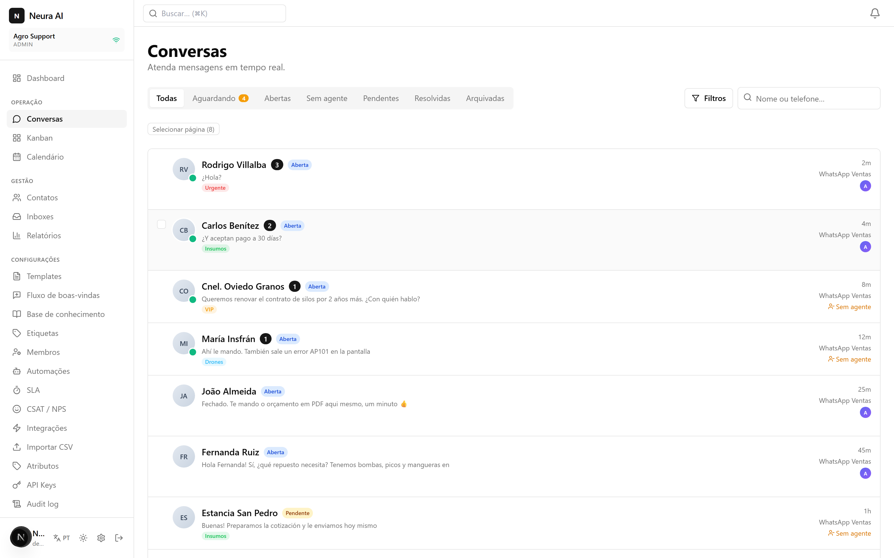
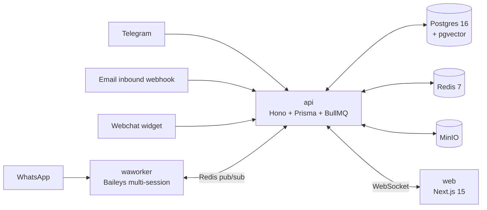

# Neura AI

**Open-source, self-hosted customer support platform for WhatsApp** — a real-time kanban inbox with SLA tracking, automations, and AI assist. Multi-tenant by design.

[](LICENSE)
[](https://github.com/kalany7w/neura-ai/actions/workflows/ci.yml)
[](tsconfig.base.json)

Think Chatwoot, but WhatsApp-first, kanban-native, and built on a modern TypeScript stack (Hono + Next.js 15 + Prisma + BullMQ).

> **⚠️ Unofficial WhatsApp integration.** The WhatsApp channel uses [Baileys](https://github.com/WhiskeySockets/Baileys), which is **not** endorsed by WhatsApp/Meta and may violate their Terms of Service. Numbers can be banned — especially if used for bulk messaging. Use it for customer-initiated support conversations, at your own risk, preferably with a dedicated number. This project is not affiliated with WhatsApp or Meta.



<details>
<summary>More screenshots — conversation view & inbox</summary>




</details>

## Features

- **Channels**: WhatsApp (Baileys, QR pairing, multi-session), Telegram, Email (SMTP/Resend outbound + generic inbound webhook), embeddable webchat widget
- **Real-time kanban inbox**: drag-and-drop cards, live updates over WebSocket in every open browser — no refresh, ever
- **SLA policies** with visual escalation, saved filters, full-text search, labels
- **Multi-tenant**: isolated workspaces, granular roles (admin / supervisor / agent), audit log on sensitive actions
- **AI assist** (optional, bring your own OpenAI key): audio transcription (Whisper), reply suggestions, conversation summaries, next-action hints, knowledge-base RAG over pgvector — all degrade gracefully when no key is set
- **Automations**: welcome flows, scheduled messages, templates, CSAT surveys
- **Ops-grade**: reports & dashboards, contact import, REST API with API keys, HMAC-signed outbound webhooks, rate limiting, CSP, AES-256-encrypted channel secrets

## Architecture



Monorepo (pnpm + turbo): `apps/api` (Hono REST + WS), `apps/web` (Next.js UI), `apps/waworker` (Baileys worker, auth state AES-256-encrypted in Postgres), `packages/database` (Prisma), `packages/shared`.

## Quickstart (self-hosted)

Requirements: Docker + Docker Compose, an SMTP account (or [Resend](https://resend.com)) for transactional email.

```bash
git clone https://github.com/kalany7w/neura-ai.git && cd neura-ai
cp .env.example .env
# fill in: POSTGRES_PASSWORD, MINIO_ROOT_PASSWORD, MAIL_FROM, SMTP_* (or RESEND_API_KEY),
# and generate two secrets:  openssl rand -hex 32  → BETTER_AUTH_SECRET, ENCRYPTION_KEY
docker compose -f docker-compose.selfhost.yml up -d --build
```

Open `http://localhost:7302`, create your account, connect WhatsApp by scanning the QR code. Migrations run automatically on boot. Full guide (reverse proxy, public domains, email inbound, backups): [docs/SELF_HOSTING.md](docs/SELF_HOSTING.md).

## Local development

```bash
corepack enable && corepack prepare pnpm@11.1.1 --activate
pnpm install
docker compose -f docker-compose.dev.yml up -d   # Postgres + Redis + MinIO
cp .env.example .env                              # fill as above
pnpm db:migrate:dev
pnpm dev                                          # api :7301 · web :7302 · waworker :7303
```

Tests: `pnpm test` (unit + integration; integration tests need a `neura_ai_test` database).

## Managed version

Don't want to host it yourself? A managed cloud version (with the official WhatsApp Business API) is in the works — join the waitlist at [neura-ai.net](https://neura-ai.net).

## Contributing

PRs welcome — see [CONTRIBUTING.md](CONTRIBUTING.md).

## License

[AGPL-3.0](LICENSE). You can self-host, modify, and use it commercially; if you offer a modified version as a service, you must open-source your changes.
